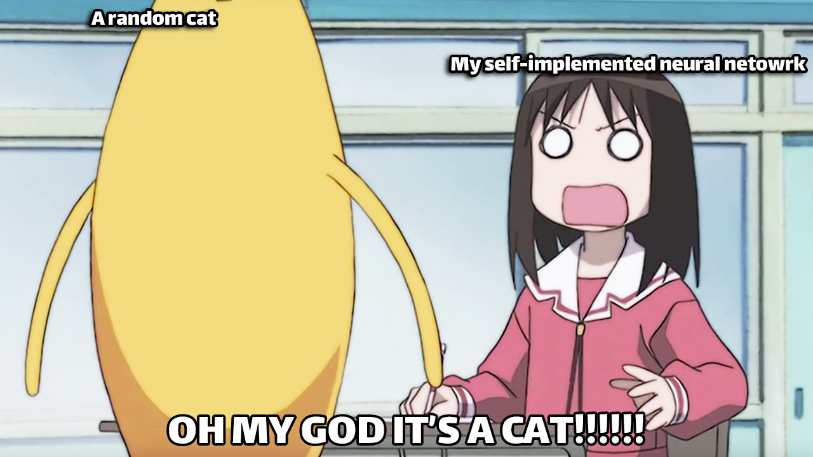

<div align="center"><h1>Logistic Regression Neural Network (From Scratch)</h1></div>


[](https://www.python.org/)
[](https://jupyter.org/)
[](https://github.com/work-atrvoid/project-mlp/stargazers)

**This project implements a logistic regression neural network from scratch without using libraries like sklearn for model creation.** The goal is to build a binary classifier that predicts whether an image is of a cat or not. The implementation focuses on understanding the underlying mathematical concepts of neural networks and logistic regression.

<div align="center"><h3>Features</h3></div><hr>

- Implementation of logistic regression as the neural network kernel.
- Forward and backward propagation using mathematical formulas.
- Training the model using gradient descent.

<div align="center"><h3>How it works</h3></div><hr>

1. **Data Representation**
   
   - Input data: Feature matrix `X` (shape: `n x m`) where each column is an example.
   - Labels: Vector `Y` (shape: `1 x m`), where values are 0 (non-cat) or 1 (cat).

2. **Model Components**
   
   - Linear transformation:
   - Activation: Relu/Sigmoid function
   - Cost: Binary cross-entropy loss.

3. **Training Process**
   
   - Forward propagation to compute predictions and cost.
   - Backward propagation to calculate gradients.
   - Gradient descent to update weights and biases.

<div align="center"><h3>How to Run This Project</h3></div><hr>

1. Clone the repository:
   
   ```bash
   git clone https://github.com/work-atrvoid/nns-from-scratch
   cd nns-from-scratch
   ```

2. Install dependencies:
   
   ```bash
   pip install -r requirements.txt
   ```

3. Run the notebook to explore the implementation and results:
   
   ```bash
   jupyter notebook---
   ```

<div align="center"><h3>Learning Outcomes</h3></div><hr>

This project reinforces the following concepts:

- Forward and backward propagation in neural networks.
- The mathematical foundation of logistic regression.
- Implementing a machine learning model without high-level libraries.

<div align="center"><h3>Questions and Feedback</h3></div><hr>
If you have any questions or feedback regarding this project, please feel free to contact me. I welcome any thoughts or suggestions you may have!

If you enjoyed my work or found this repo helpful, please consider giving it a star! Your support encourages me to keep improving and sharing my projects with the community. Thank you!
